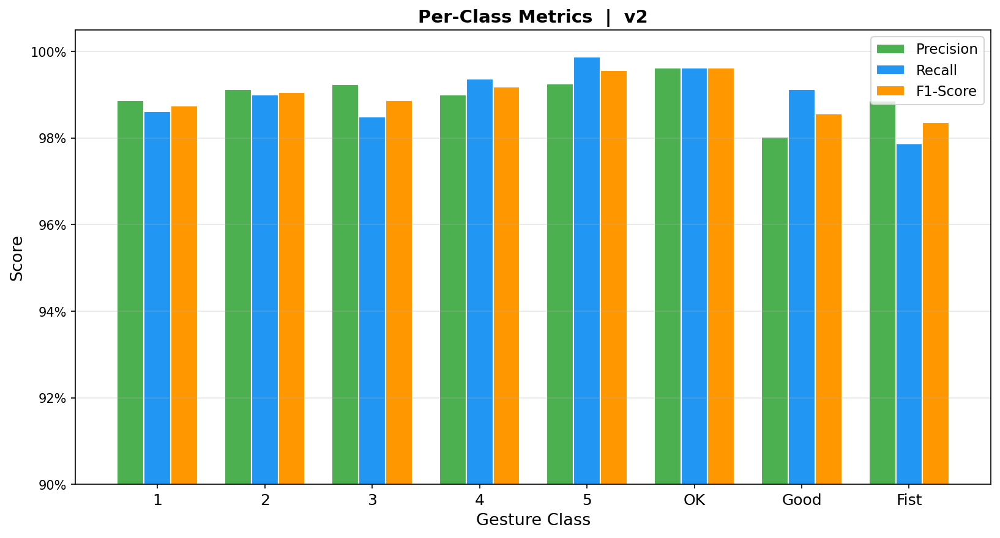

<p align="center">
  <h1 align="center">✋ Hand Gesture Recognition Control System</h1>
  <p align="center">
    Real-time hand gesture recognition based on <strong>MediaPipe + KNN</strong><br>
    Designed for embedded deployment on Raspberry Pi with GPIO peripheral control
  </p>
</p>

<p align="center">
  
  
  
  
  
  
</p>

---

## 📖 Overview

A real-time hand gesture recognition pipeline: **Camera → MediaPipe Hand Landmarks → Feature Extraction → KNN Classification → GPIO Control**. Recognizes 8 static hand gestures and controls LED, fan, and buzzer peripherals on Raspberry Pi.

Built as part of an integrated upper-computer system with PyQt5 GUI, serial communication, and motor control capabilities.

### 🎯 8 Gesture Classes

| Gesture | Display | Description |
|---------|---------|-------------|
| ☝️ Index Up | `1` | Single index finger raised |
| ✌️ Two Fingers | `2` | Index + middle fingers raised |
| 🤟 Three Fingers | `3` | Three fingers raised |
| 🖖 Four Fingers | `4` | Four fingers raised |
| 🖐️ Five Fingers | `5` | Open palm, all fingers |
| 👌 OK Sign | `OK` | Thumb + index circle |
| 👍 Thumbs Up | `Good` | Thumb pointing up |
| ✊ Fist | `Fist` | Closed fist |

---

## ✨ Features

- **Real-time Pipeline**: End-to-end from camera capture to GPIO output
- **32-Dimensional Features**: Distance + angle + finger states + thumb-specific features
- **KNN Classifier**: K=3, distance-weighted, 99.0% accuracy on HaGRID v2 test set
- **English UI**: OpenCV overlay with gesture name, FPS counter, and confidence bar
- **Anti-jitter Smoothing**: 5-frame majority vote + thumb-angle guard for 4↔5 disambiguation
- **GPIO Control**: LED, Fan, Buzzer triggered by recognized gestures
- **Cross-platform**: Raspberry Pi (RPi.GPIO) or PC (mock GPIO for development)
- **PyQt5 Upper-computer**: Integrated GUI with serial motor control, gesture visualization, and logging

---

## 🚀 Quick Start

```bash
# 1. Clone the repository
git clone https://github.com/just-zzk/hand.git
cd hand

# 2. Install dependencies
pip install -r requirements.txt

# 3. Run the system
python src/main.py

# Options:
python src/main.py --no-control    # Recognition only (no GPIO)
python src/main.py --skip 1        # Process every frame

# Press 'q' to quit.
```

---

## 📁 Project Structure

```
project/
├── src/                           # Core source code
│   ├── main.py                    # Real-time pipeline entry point
│   ├── capture/camera.py          # USB camera capture (OpenCV)
│   ├── detection/hand_detector.py # MediaPipe HandLandmarker wrapper
│   ├── features/extractor.py      # 32-dim feature extraction
│   ├── classifier/knn_classifier.py # KNN classifier with save/load
│   └── control/gpio_control.py    # GPIO peripheral control
│
├── scripts/                       # Utility scripts
│   ├── train_hagrid.py            # Train KNN from HaGRID landmarks
│   ├── convert_hagrid.py          # Convert HaGRID annotations → features
│   ├── export_pictures.py         # Export hand skeleton visualizations
│   ├── deploy_pi.py               # Package for Raspberry Pi deployment
│   ├── train.py                   # Training from raw images
│   └── collect_data.py            # Manual camera data collection
│
├── experiments/                   # Experiment & benchmark scripts
│   ├── exp1_detection_test.py     # MediaPipe detection validation
│   ├── exp2_knn_performance.py    # KNN accuracy benchmarking
│   ├── exp3_feature_selection.py  # Feature ablation studies
│   ├── exp4_realtime_test.py      # Real-time pipeline integration
│   └── exp5_control_test.py       # GPIO control integration
│
├── data/
│   ├── models/
│   │   ├── knn_model.pkl          # Trained KNN model (3.3 MB)
│   │   ├── label_map.pkl          # Label name mapping
│   │   └── version.txt            # Model version
│   └── processed/                 # Extracted feature vectors
│
├── config/config.yaml             # System configuration
├── assets/mediapipe/              # MediaPipe model files
├── graph/                         # Training visualizations
├── picture/                       # HaGRID skeleton samples (504 images)
├── docs/                          # Documentation & training logs
├── creatation/motor_control_app/  # PyQt5 upper-computer application
└── requirements.txt               # Python dependencies
```

---

## 📊 Performance

| Metric | Value |
|--------|-------|
| **Accuracy** | **99.0%** (HaGRID v2 test set, 6,400 samples) |
| **Cross-validation** | 99.07% (±0.18%, 5-fold) |
| **Macro F1** | 0.99 |
| **K-value** | K=3 (distance-weighted, Euclidean) |
| **Feature dimension** | 32 (distance + angle + finger states + thumb) |
| **Training samples** | 32,000 (8 classes × 4,000) |

### Per-class Metrics

| Gesture | Precision | Recall | F1-score |
|---------|-----------|--------|----------|
| 1 | 0.99 | 0.99 | 0.99 |
| 2 | 0.99 | 0.99 | 0.99 |
| 3 | 0.99 | 0.98 | 0.99 |
| 4 | 0.99 | 0.99 | 0.99 |
| 5 | 0.99 | 1.00 | 1.00 |
| OK | 1.00 | 1.00 | 1.00 |
| Good | 0.98 | 0.99 | 0.99 |
| Fist | 0.99 | 0.98 | 0.98 |

### Visualizations

<p align="center">
  
  
  
  
</p>

---

## 🔬 Feature Engineering

### 32-Dimensional Feature Vector

```
Distance Features (15 dims)
├── Fingertip pairwise distances: C(5,2) = 10 dims
└── Fingertip-to-wrist distances: 5 dims

Angle Features (10 dims)
├── PIP joint angles: 5 dims (thumb~pinky)
└── MCP joint angles: 5 dims (thumb~pinky)

Finger States (4 dims)
├── Index open/closed
├── Middle open/closed
├── Ring open/closed
└── Pinky open/closed
    → tip_to_wrist / MCP_to_wrist ratio ≥ 0.85 → open

Thumb-specific (3 dims)
├── thumb_to_index_mcp distance (scale-normalized)
├── thumb_to_pinky_mcp distance (scale-normalized)
└── thumb_open_ratio
```

All features computed after normalization: wrist as origin, scaled by wrist-to-middle-MCP distance for size/position invariance.

---

## 🎮 Gesture → Action Mapping

| Gesture | Display | GPIO Action | Motor Action (Upper-computer) |
|---------|---------|-------------|-------------------------------|
| 1 | Index Up | LED ON | AB forward |
| 2 | Two Fingers | LED OFF | AB reverse |
| 3 | Three Fingers | Fan ON | CD forward |
| 4 | Four Fingers | Fan OFF | CD reverse |
| 5 | Five Fingers | Buzzer beep | AB stop |
| OK | OK Sign | Buzzer beep | CD stop |
| Good | Thumbs Up | Welcome mode (LED flash ×3) | AB brake |
| Fist | Fist | All OFF | CD brake |

---

## 🔧 Raspberry Pi Deployment

```bash
# Package for Pi (generates ~10.8 MB package, excludes training data)
python scripts/deploy_pi.py --output pi_deploy

# Copy to Raspberry Pi
scp -r pi_deploy/* pi@raspberrypi:~/gesture-system/

# On Raspberry Pi:
cd ~/gesture-system
pip install -r requirements-pi.txt
python src/main.py
```

### GPIO Wiring (BCM)

| Peripheral | GPIO Pin |
|-----------|----------|
| LED | GPIO 17 |
| Fan | GPIO 18 |
| Buzzer | GPIO 27 |

---

## 📚 Dataset

Trained on **[HaGRID v2](https://github.com/hukenovs/hagrid)** (HAnd Gesture Recognition Image Dataset) by SberDevices.

| Property | Value |
|----------|-------|
| Images | 1,086,158 FullHD RGB |
| Classes | 33 gesture types |
| Subjects | 65,977 |
| Annotation format | Pre-computed MediaPipe 21-landmarks (JSON) |
| License | CC BY-SA 4.0 |

**Citation:**
> Nuzhdin et al., "HaGRIDv2: 1M Images for Static and Dynamic Hand Gesture Recognition", arXiv:2412.01508, 2024.
> Kapitanov et al., "HaGRID — HAnd Gesture Recognition Image Dataset", WACV 2024.

### Training Details

```bash
# Download annotations (719 MB → 1.1 GB JSON)
curl -L -o data/annotations.zip \
  https://rndml-team-cv.obs.ru-moscow-1.hc.sbercloud.ru/datasets/hagrid_v2/annotations_with_landmarks/annotations.zip

# Convert and train
python scripts/train_hagrid.py --k 3 --feature all --max-per-class 4000
```

---

## 🐛 Key Bug Fixes

| Bug | Root Cause | Solution |
|-----|-----------|----------|
| **4→5 misclassification** | 2D training vs 3D inference distribution shift | Thumb MCP angle guard (<140° → force "4") |
| **Finger state failure** | PIP angle threshold ineffective on 2D annotations | Distance ratio method (tip/wrist vs MCP/wrist) |
| **Chinese UI garbled** | OpenCV `putText` no CJK support on Windows | All labels to English |
| **Frame stuttering** | MediaPipe every frame too slow | Skip every 2nd frame, reuse last detection |
| **MediaPipe API break** | `mp.solutions.hands` removed in 0.10.x | Migrate to `mediapipe.tasks.python.vision.HandLandmarker` |

---

## 🖥️ Upper-computer Integration

The gesture recognition model is integrated into a PyQt5 upper-computer application (`creatation/motor_control_app/`) featuring:

- **Real-time visualization**: Color-coded skeleton, glow effects on fingertips, semi-transparent result panel
- **Confidence display**: Color-coded progress bar (green ≥80%, gold ≥50%, red <50%)
- **5-frame logging**: Anti-noise signal emission to main thread
- **Serial motor control**: Gesture → serial command → motor driver
- **Dark theme UI**: Custom-styled widgets with gradient backgrounds

For full details, see [`docs/MODIFICATION_LOG.md`](docs/MODIFICATION_LOG.md).

---

## 📋 Training History

| Version | Features | K | Accuracy | CV Score | 4→5 Errors |
|---------|----------|---|----------|----------|------------|
| v1 | 25 (distance + angle) | 5 | 98.85% | 98.83% | 3/600 |
| v1.1 | 25 (distance + angle) | 3 | 99.02% | 99.00% | 2/800 |
| v1.2 | 33 (+finger states +thumb) | 3 | 99.05% | 99.03% | 1/800 |
| **v2** | **32 (+fixed states +thumb)** | **3** | **99.00%** | **99.07%** | **2/800** |

> v2 achieves the highest cross-validation score (99.07%), indicating best generalization. Distance-ratio finger state detection is compatible with both 2D (HaGRID) and 3D (real-time MediaPipe).

---

## 📄 License

Apache 2.0 (MediaPipe components) + Project code.

---

## 🙏 Acknowledgments

- [MediaPipe](https://github.com/google-ai-edge/mediapipe) — Google's hand landmark detection
- [HaGRID](https://github.com/hukenovs/hagrid) — SberDevices' large-scale gesture dataset
- [scikit-learn](https://scikit-learn.org/) — KNN implementation and evaluation tools
