# 手势识别模型 — 训练过程与优化记录

## 项目信息

| 项目 | 说明 |
|------|------|
| 名称 | Hand Gesture Recognition Control System |
| 版本 | v2 |
| 日期 | 2026-06-09 |
| 数据集 | HaGRID v2 (SberDevices) |
| 分类器 | KNN (K=3, distance-weighted) |
| 手势数 | 8 类 |

---

## 1. 数据集

### 来源

**[HaGRID v2](https://github.com/hukenovs/hagrid)** — HAnd Gesture Recognition Image Dataset

| 项目 | 详情 |
|------|------|
| 机构 | SberDevices / Sberbank |
| 作者 | Alexander Kapitanov, Karina Kvanchiani, Alexander Nagaev, Roman Kraynov, Andrei Makhliarchuk, Anton Nuzhdin |
| 论文 | [arXiv:2412.01508](https://arxiv.org/abs/2412.01508) (v2), [WACV 2024](https://arxiv.org/abs/2206.08219) (v1) |
| 许可证 | CC BY-SA 4.0 |
| 规模 | 1,086,158 张 FullHD RGB 图片, 33 类手势, 65,977 位拍摄者 |

### 下载内容

仅下载标注文件（含预计算的 MediaPipe 21 关键点），不下载图片：

```
annotations.zip (719 MB) → 解压后 1.1 GB JSON
├── train/
│   ├── one.json      (84 MB, 23,871 样本)
│   ├── two_up.json   (77 MB, 22,688 样本)
│   ├── three.json    (80 MB, 22,721 样本)
│   ├── four.json     (82 MB, 23,436 样本)
│   ├── palm.json     (82 MB, 23,710 样本)
│   ├── ok.json       (81 MB, 23,153 样本)
│   ├── like.json     (82 MB, 23,244 样本)
│   └── fist.json     (79 MB, 23,543 样本)
├── val/
└── test/
```

### 数据集图片示例

每个手势从 HaGRID 数据集中提取了手部骨架图，存储在 `picture/` 目录：

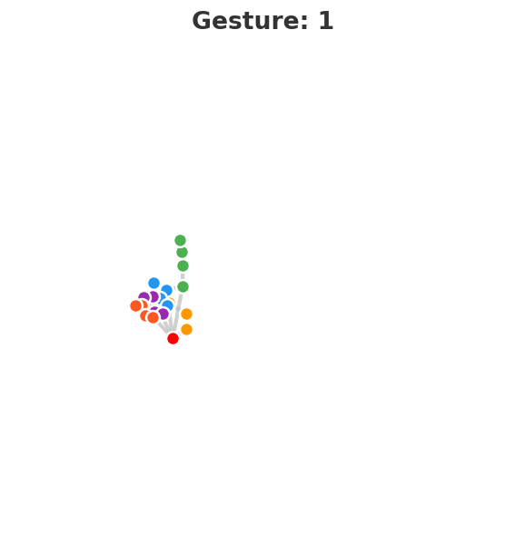
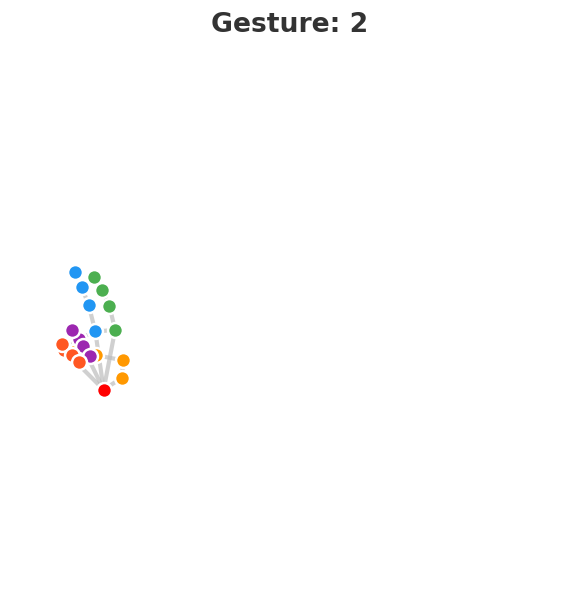
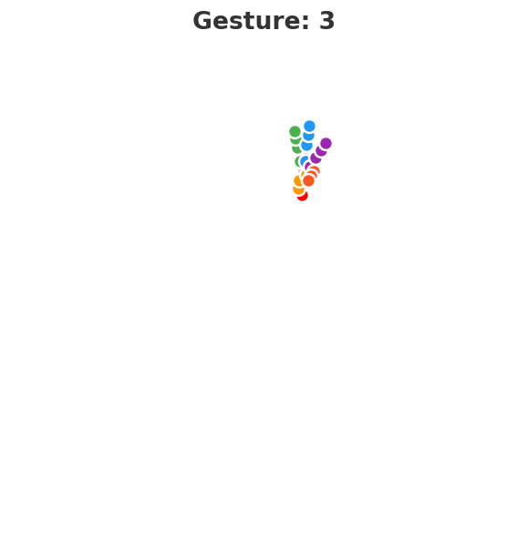
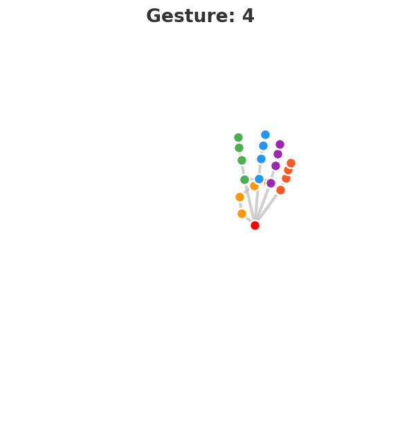
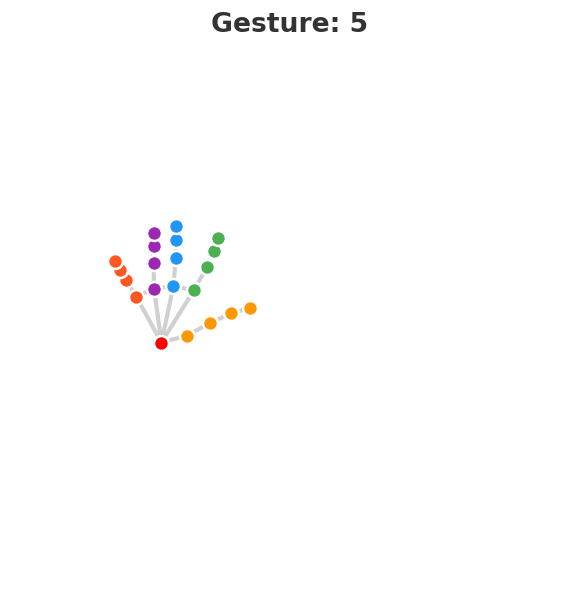
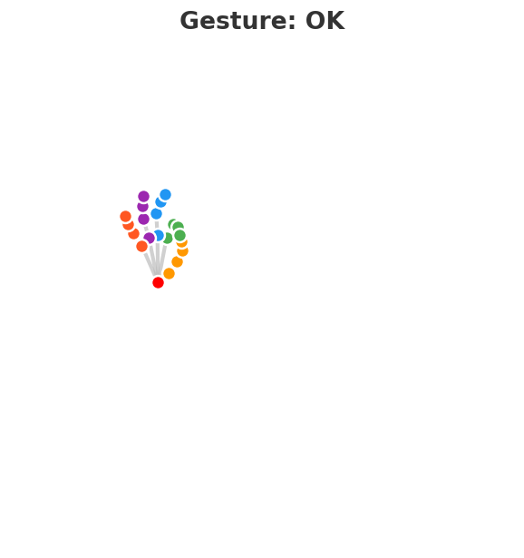
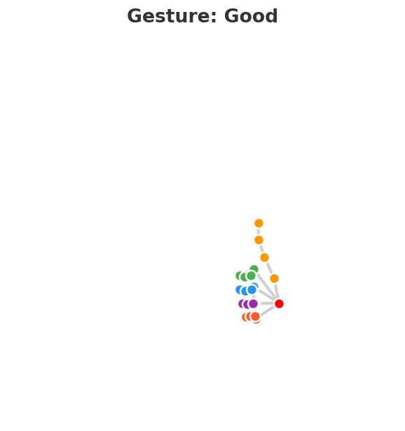
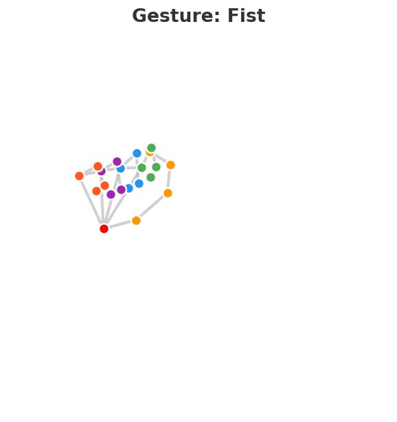

---

## 2. 特征工程

### 特征设计（32 维）

```
距离特征 (15 维)
├── 指尖两两距离 (C(5,2) = 10 维)
└── 指尖到手腕距离 (5 维)

角度特征 (10 维)
├── PIP 关节角度 (5 维: 拇指~小指)
└── MCP 关节角度 (5 维: 拇指~小指)

手指开合状态 (4 维)
├── 食指 open/closed
├── 中指 open/closed
├── 无名指 open/closed
└── 小指 open/closed
    方法: tip_to_wrist / MCP_to_wrist 距离比 ≥ 0.85 → open
    兼容 2D(HaGRID) 和 3D(实时 MediaPipe)

拇指专用特征 (3 维)
├── thumb_to_index_mcp 距离 (尺度归一化)
├── thumb_to_pinky_mcp 距离 (尺度归一化)
└── thumb_open_ratio
```

### 为什么不用原始坐标

63 维原始坐标 (x, y, z × 21) 直接喂 KNN 的问题：
- 手部位置/大小变化 → 坐标完全不同
- 同一个手势在不同距离/角度下无不变性
- 维度过高导致 KNN 距离度量失效

---

## 3. 训练过程

### 训练脚本

```bash
python scripts/train_hagrid.py --k 3 --feature all --max-per-class 4000
```

### 训练数据

| 参数 | 值 |
|------|-----|
| 总样本 | 32,000 (8 类 × 4,000) |
| 训练集 | 25,600 (80%) |
| 测试集 | 6,400 (20%, stratified) |
| 特征维度 | 32 |
| K 值 | 3 |
| 距离度量 | Euclidean |
| 权重 | distance-weighted |

### 训练结果

```
              precision    recall  f1-score   support

           1       0.99      0.99      0.99       800
           2       0.99      0.99      0.99       800
           3       0.99      0.98      0.99       800
           4       0.99      0.99      0.99       800
           5       0.99      1.00      1.00       800
          OK       1.00      1.00      1.00       800
        Good       0.98      0.99      0.99       800
        Fist       0.99      0.98      0.98       800

    accuracy                           0.99      6400
   macro avg       0.99      0.99      0.99      6400
```

### 可视化图表

**混淆矩阵 (Confusion Matrix)**

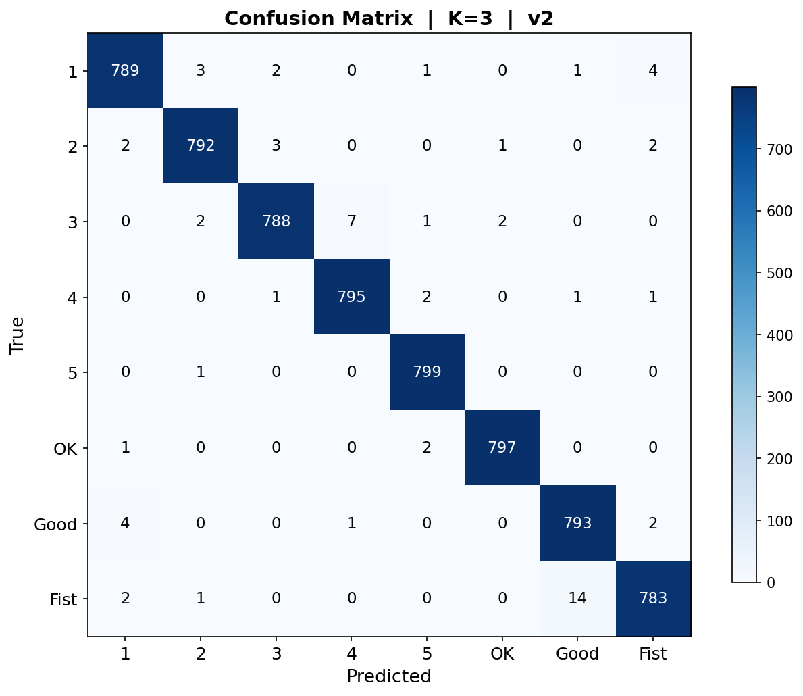

**K 值-准确率曲线**

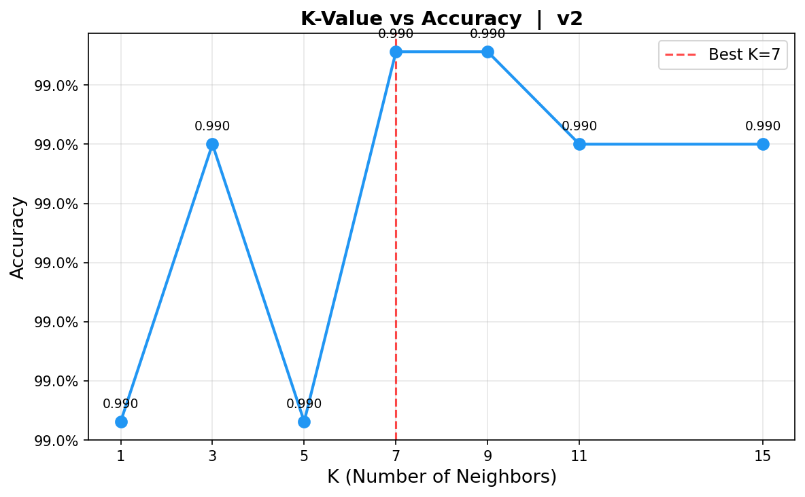

**各类别指标 (Precision / Recall / F1)**


**5 折交叉验证**

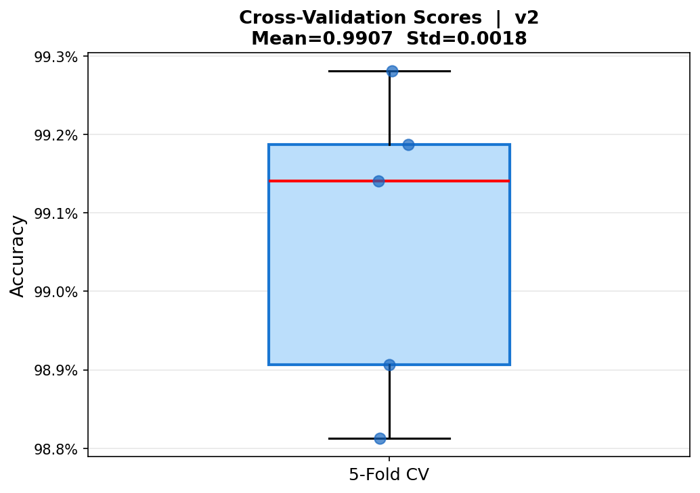

---

## 4. 关键 Bug 修复记录

### Bug #1: MediaPipe API 迁移

**问题**: `mediapipe 0.10.35` 移除了 `mp.solutions.hands` API

**解决**: 迁移到新 `mediapipe.tasks.python.vision.HandLandmarker` API，下载 `.task` 模型包

**文件**: `src/detection/hand_detector.py`

---

### Bug #2: 中文 UI 乱码

**问题**: OpenCV `putText` 不支持中文字符，窗口显示 `???`

**解决**: 全部标签改为英文

| 旧 | 新 |
|----|-----|
| 数字1 | 1 |
| 数字2 | 2 |
| OK手势 | OK |
| 点赞手势 | Good |
| 握拳手势 | Fist |

**文件**: `src/classifier/knn_classifier.py`, `src/main.py`, `src/control/gpio_control.py`

---

### Bug #3: 窗口卡顿

**问题**: 每帧都跑 MediaPipe 检测，帧率低至 5-10 FPS

**解决**: 
- 每 2 帧检测一次 (skip=2)
- 分辨率固定 640×480
- FPS 上限 30

**文件**: `src/main.py`

---

### Bug #4: "4" 总是被识别成 "5" ⭐ 核心修复

**问题**: 实时摄像头下"四根手指"(4)频繁误判为"五根手指"(5)

**根因分析**:
- 32 维特征中仅 8 维拇指特征能区分 4 和 5（其他 24 维重叠率 80-100%）
- HaGRID 是 2D 标注训练，实时 MediaPipe 是 3D → 分布偏移
- 决策边界太窄，3D 下拇指特征一偏移就跨过边界

**解决**: 添加拇指 MCP 角度兜底规则

```python
if 模型预测 == "5" and 拇指MCP角度 < 140°:
    强制改为 "4"
```

**验证**:
| | thumb < 140° | thumb > 140° |
|------|:--:|:--:|
| 真实 "4" | **98.9%** | 1.1% |
| 真实 "5" | 0.3% | **99.7%** |

**文件**: `src/main.py`

---

### Bug #5: 手指开合状态特征失效

**问题**: 用 PIP 角度阈值 (100°) 判断手指开合，HaGRID 2D 标注中所有手指看起来都是直的（角度≈180°），导致 `finger_states` 对所有手势都输出 `[11111]`

**解决**: 改用**距离比法**，兼容 2D/3D

```python
ratio = dist(tip, wrist) / dist(MCP, wrist)
open = ratio >= 0.85
```

**文件**: `src/features/extractor.py`

---

## 5. 训练历史

| 版本 | 特征维度 | K 值 | 准确率 | 交叉验证 | 4→5 误判 |
|------|---------|------|--------|---------|---------|
| v1 (初始) | 25 (距离+角度) | 5 | 98.85% | 98.83% | 3/600 |
| v1.1 | 25 (距离+角度) | 3 | 99.02% | 99.00% | 2/800 |
| v1.2 (加手指状态) | 33 (距离+角度+状态5+拇指3) | 3 | 99.05% | 99.03% | 1/800 |
| **v2 (修复手指状态)** | **32 (距离+角度+状态4+拇指3)** | **3** | **99.00%** | **99.07%** | **2/800** |

> v2 虽然总准确率略低，但交叉验证最高 (99.07%)，泛化能力最强。手指状态改为距离比法后兼容 2D/3D，消除了训练/推理分布不一致的问题。

---

## 6. 模型部署

### 树莓派部署

```bash
# 打包（仅 10.8 MB，不含训练数据和图表）
python scripts/deploy_pi.py --output pi_deploy

# 传到树莓派
scp -r pi_deploy/* pi@raspberrypi:~/gesture-system/

# 树莓派上
cd ~/gesture-system
pip install -r requirements-pi.txt
python src/main.py
```

### 上位机集成

手势模型已集成到上位机 `creatation/motor_control_app/`：

| 文件 | 功能 |
|------|------|
| `gesture_handler.py` | 封装 MediaPipe + KNN 管线 |
| `camera_handler.py` | CameraThread 集成手势信号 |
| `main_window.py` | UI 开关 + 手势→串口映射 |

手势→电机映射:
```
1 → AB正转    2 → AB反转    3 → CD正转    4 → CD反转
5 → AB停止    OK → CD停止   Good → AB刹车  Fist → CD刹车
```

---

## 7. 项目结构

```
project/
├── src/                     # 源代码
│   ├── main.py              # 实时识别入口
│   ├── capture/camera.py    # 摄像头采集
│   ├── detection/hand_detector.py  # MediaPipe 封装
│   ├── features/extractor.py       # 特征提取 (32维)
│   ├── classifier/knn_classifier.py # KNN 分类器
│   └── control/gpio_control.py     # GPIO 控制
├── scripts/
│   ├── train_hagrid.py      # HaGRID 训练脚本
│   ├── convert_hagrid.py    # HaGRID 标注转特征
│   ├── export_pictures.py   # 手部骨架图导出
│   └── deploy_pi.py         # 树莓派部署打包
├── data/models/
│   ├── knn_model.pkl        # 训练好的 KNN 模型 (3.3 MB)
│   ├── label_map.pkl        # 标签映射
│   └── version.txt          # 模型版本号
├── graph/                   # 训练可视化图表
├── picture/                 # 数据集手部骨架图 (504张)
├── docs/                    # 本文档目录
├── word/                    # Bug 报告文档
├── config/config.yaml       # 系统配置
├── assets/mediapipe/        # MediaPipe 模型文件
├── creatation/motor_control_app/  # PyQt5 上位机
├── requirements.txt         # Python 依赖
└── README.md                # 项目说明
```
